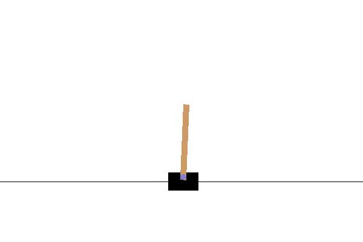

# Reinforcement-Learning-Practice
1. **Cartpole**
A pole is attached by an un-actuated joint to a cart, which moves along a frictionless track. The system is controlled by applying a force of +1 or -1 to the cart. The pendulum starts upright, and the goal is to prevent it from falling over. A reward of +1 is provided for every timestep that the pole remains upright. The episode ends when the pole is more than 15 degrees from vertical, or the cart moves more than 2.4 units from the center.

2. **FrozenLake (Q-learning) **
Winter is here. You and your friends were tossing around a frisbee at the park when you made a wild throw that left the frisbee out in the middle of the lake. The water is mostly frozen, but there are a few holes where the ice has melted. If you step into one of those holes, you'll fall into the freezing water. At this time, there's an international frisbee shortage, so it's absolutely imperative that you navigate across the lake and retrieve the disc. However, the ice is slippery, so you won't always move in the direction you intend. 

This grid is our environment where `S` is the agent’s starting point, and it’s safe. `F` represents the frozen surface and is also safe. `H` represents a hole, and if our agent steps in a hole in the middle of a frozen lake, well, that’s not good. Finally, `G` represents the goal, which is the space on the grid where the prized frisbee is located.

The agent can navigate `left`, `right`, `up`, and `down`, and the episode ends when the agent reaches the goal or falls in a hole. It receives a reward of one if it reaches the goal, and zero otherwise.

Our agent has to navigate the grid by staying on the frozen surface without falling into any holes until it reaches the frisbee. If it reaches the frisbee, it wins with a reward of plus one. If it falls in a hole, it loses and receives no points for the entire episode.